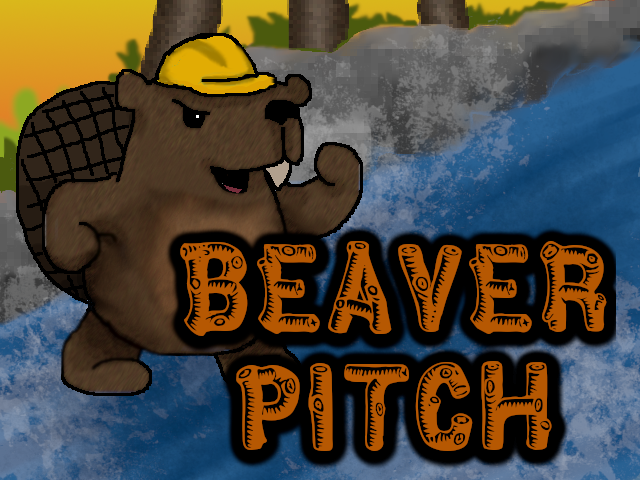

# Beaver Pitch
Written in 48 hours for [Ludum Dare 42](https://ldjam.com/events/ludum-dare/42/beaver-pitch). The theme was "Running out of space".

## What
Barnaby the beaver’s lodge is under attack by a bunch of naughty neighbour beavers. They want to steal Barnaby’s logs to use in their own dams. You have to stop them!

My idea was that Barnaby can’t swim, so as the logs are stolen he is *running out of space*. Sadly, there's a bug in v0.1.0 which allows Barnaby to swim/walk on water, so you'll have to imagine that part. Fix coming soon.

Unfortunately, I ran out of time to get the game working well, or to do animations or music. There is no victory condition, either, so you can't win at the moment :(

Feel free to use my code and art for anything you like. Let me know if you find it useful!

## Download
Windows, Mac and Linux versions are on the [releases page](https://github.com/andyhd/ld42/releases)

## How to Play
Use the arrow keys to move Barnaby

Walk into the attacking beavers to get rid of them

## Thanks
* Made possible by Pavel Korolev's [trivial-gamekit](https://github.com/borodust/trivial-gamekit) - this makes it easy to use   OpenGL and OpenAL; load images, sounds and fonts; and compile Windows, Linux and Mac binaries. Highly recommended!
* [GIMP](https://www.gimp.org/) for graphics
* [Bfxr](https://www.bfxr.net/) for generating sound effects
* [Quicklisp](https://www.quicklisp.org/beta/)
* [Steel Bank Common Lisp](http://www.sbcl.org/)
* Typographer Mediengestalter for the [Pinewood font](https://www.1001fonts.com/pinewood-font.html)
